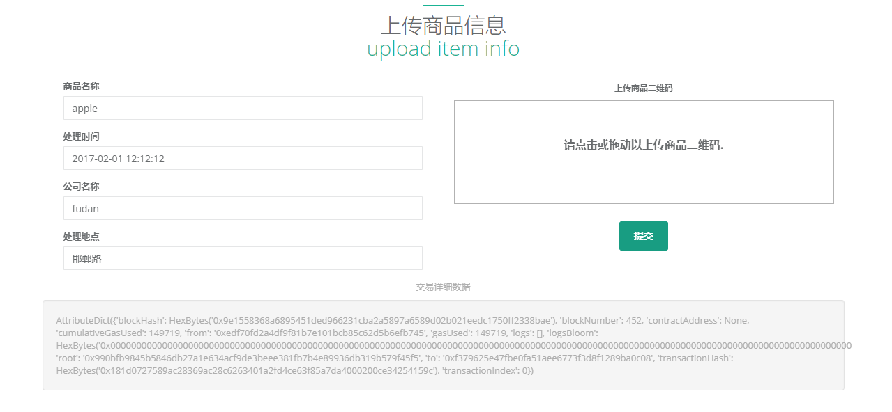
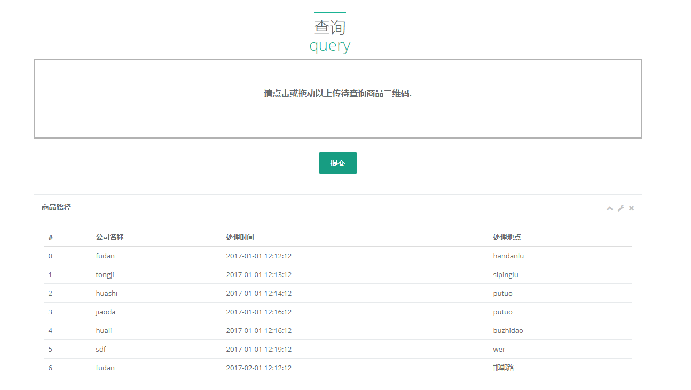
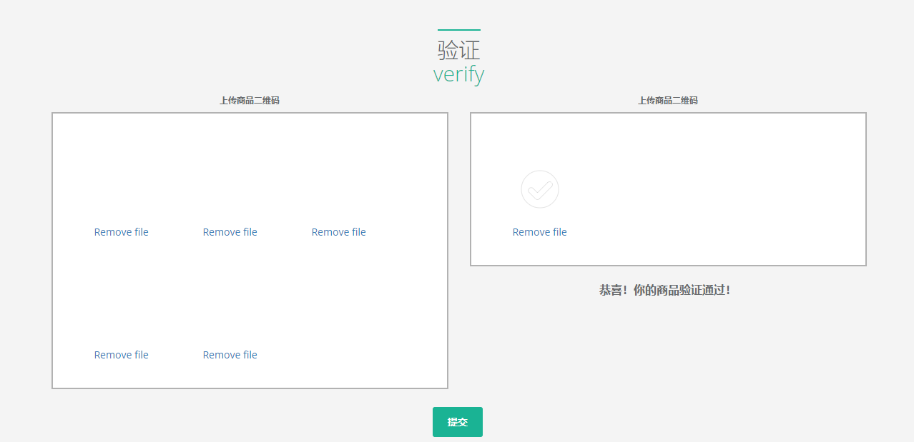

# 基于区块链和MerkleTree的防伪溯源系统


思路是利用MerkleTree，在子商品和父包装建立强相关性，加大防伪力度。

目前挖矿是每次交易的时候启动一次挖矿，为了保证解密成功，时间为10s，所以每次写入会等待10s时间，并非卡顿,这一点很好解决，只要有一个单独节点一直启动挖矿就可以，开发环境这里因为怕产生过多区块，故没有这样做

**注意！为了统一addItem和addPath两个API，第一次提交商品时会自动判断出是首次，然后先做addItem再做AddPath，所以会挖矿20s！延迟主要在这里**
## 特性
- 支持快速动态加入节点
- 支持在任意区块链节点插入和查询链
- 可复用
## 环境 :
前端 : HTML5（jQuery）+ Tomcat7

后端 : Flask + Nginx + Gunicorn

区块链 : Ethereum

- python 3.6
- solidity 0.4.8

- python requirements:
  - solc : 编译智能合约
  - flask : 后端框架
  - web3.py : 以太坊API
  - zxing : 二维码解析
  - qrcode : 二维码生成

- JavaScript requirements
  - Dropzone.js : 文件上传
  - inspinia.js : UI
  - bootstrap.js jquery-3.1.1.js : 基础模块

## 文件、模块说明
### web
- **index.html** : 前端页面
- *61.html* : index的copy，但是全部操作通过61节点
### MerkleTrace
- **config/config.yaml** : 存放用户名、合约地址等信息，会在合约部署的时候自动写入
- **src/deploy_contract.py** : 专门用来部署合约的类
- **src/MerkleTree.py** :MerkleTree 计算类
- **smartContrace/MerkleTrace.sol** :智能合约
- **MerkleTraceRun.py** :后端系统API
- **utils/bc_utils.py qr_utils query_utils** :一些可复用的工具函数
详见代码注释
## 架构设计（简略版）
1.
前端页面传入商品的二维码，并提交json格式的其它必要信息，数据由ajax传输。注意，图片拖拽即完成上传，无需提交按钮.</br>
提交按钮实际上访问了两个API，一个是功能API，一个是/delete负责删除服务器上本次上传的所有图片.</br>
后端会首先解析二维码得到item_key，然后进行后续操作，最终会统一删除'./upload'下所有单个文件.</br>

2.
前端传入的信息中，以下部分固定写死，即都通过59节点的用户0完成操作，实际上任何节点任何用户都可以，不过每一个节点应该运行自己的一个C/S服务器，</br>
所以对于每个前端，这部分本身就是固定的，并非由用户提供
```
{
    "address": "0xEdf70Fd2a4DF9f81b7e101Bcb85C62d5b6EFB745",
    "passwd": "user1",
    "url": "http://10.141.211.59:8545"
}
```
3.
计算MerkleRoot这里采用了补齐操作，补齐的长度是 int(math.log(len(leaf_list), 2)) + 1.
MerkleTree的叶子顺序会影响Root的值，这里用首次提交时间排序，所以**一定要先提交商品，再算MerkleRoot**
## 网页端功能
图片上传用Dropzone.js 实现，不过UI有点诡异，可能跟inspinia某些地方冲突了，图片缩略图是白的
### 上传商品

### 计算MerkleRoot

### 查询

### 验证

## API
**/deployContract**: 部署合约

example :

```
{
	"address": "0xEdf70Fd2a4DF9f81b7e101Bcb85C62d5b6EFB745",
	"passwd": "user1",
	"url": "http://10.141.211.59:8545"
}
```
response:
```
{
    "result": "contract address is 0x6F906dE4596B1A57a9040B65a28F6da640B16e9a"
}
```
**/addItem**: 添加新的商品

***基本弃置，现在/addPath会做一次检查，如果是第一次加入自动调用_add_item***

example :
```
{
    "address": "0xEdf70Fd2a4DF9f81b7e101Bcb85C62d5b6EFB745",
    "passwd": "user1",
    "url": "http://10.141.211.59:8545",
    "img_file": <img_file_name>,
    "item_name": "apple"
}
```
response:
```
{
    "result": "AttributeDict({'blockHash': HexBytes('0xe236c25db907f1f25653f1fc38da83c8bc176eaea8d42a307f9e981b64826952'), 'blockNumber': 232, 'contractAddress': None, 'cumulativeGasUsed': 44934, 'from': '0xedf70fd2a4df9f81b7e101bcb85c62d5b6efb745', 'gasUsed': 44934, 'logs': [], 'logsBloom': HexBytes('0x00000000000000000000000000000000000000000000000000000000000000000000000000000000000000000000000000000000000000000000000000000000000000000000000000000000000000000000000000000000000000000000000000000000000000000000000000000000000000000000000000000000000000000000000000000000000000000000000000000000000000000000000000000000000000000000000000000000000000000000000000000000000000000000000000000000000000000000000000000000000000000000000000000000000000000000000000000000000000000000000000000000000000000000000000000000'), 'root': '0x3f1c8c14610894b4b46b5671ed1bb3394e325055c219b2e15c2b0141edea8ebd', 'to': '0x6f906de4596b1a57a9040b65a28f6da640b16e9a', 'transactionHash': HexBytes('0x40da1fe4b716e61ca362341e2418b33cf3eea06c3620bcbd3f5c24aadaf36680'), 'transactionIndex': 0})"
}
```
**/addPath**:

*在以存放商品中添加路径，请按时间顺序提交，last_time > submit_time 会报错*

example :

```
{
	"address": "0xEdf70Fd2a4DF9f81b7e101Bcb85C62d5b6EFB745",
	"passwd": "user1",
	"url": "http://10.141.211.59:8545",
	"img_file": <img_file_name>,
	"item_path": {
		"time": "2019.01.02",
		"node_name":"pekingU",
		"location":"beijing"
	}
}
```
response:
```
{
  "result": "AttributeDict({'blockHash': HexBytes('0x423ebd25d06013a5ef054b14ab891a5c00d50f280ceedbc1dbdf09c4ec1242ac'), 'blockNumber': 242, 'contractAddress': None, 'cumulativeGasUsed': 53863, 'from': '0xedf70fd2a4df9f81b7e101bcb85c62d5b6efb745', 'gasUsed': 53863, 'logs': [], 'logsBloom': HexBytes('0x00000000000000000000000000000000000000000000000000000000000000000000000000000000000000000000000000000000000000000000000000000000000000000000000000000000000000000000000000000000000000000000000000000000000000000000000000000000000000000000000000000000000000000000000000000000000000000000000000000000000000000000000000000000000000000000000000000000000000000000000000000000000000000000000000000000000000000000000000000000000000000000000000000000000000000000000000000000000000000000000000000000000000000000000000000000'), 'root': '0x72e5e2ec45aba7122b574a7bf3075934d3c2c4e1e18849a00e231128e5b01610', 'to': '0x6f906de4596b1a57a9040b65a28f6da640b16e9a', 'transactionHash': HexBytes('0x570df57a144ab6e886588897ea9c0b5bae78bd233225463ade77bd30c843a204'), 'transactionIndex': 0})"
}
```
**/getPath**: 获取商品的路径信息

example :

```
{
    "url": "http://10.141.211.59:8545",
	"img_file": <img_file_name>
}
```
response:
```
{
	"result": {
		"item_name": "apple",
		"iterm_path": [{
				"location": "beijing",
				"node_name": "pekingU",
				"time": "2019.01.02"
			},
			{
				"location": "sahngahi",
				"node_name": "fudan",
				"time": "2019.01.03"
			}
		]
	}
}
```
**/getFirstTime**: 获取商品第一次提交的时间

example:

```
{
	"url": "http://10.141.211.59:8545",
	"img_file": <img_file_name>
}
```
response:
```
{
    "result": "2019.01.02"
}
```
**/getLastTime**: 获取商品最后一次提交的时间

example:

```
{
	"url": "http://10.141.211.59:8545",
	"img_file": <img_file_name>
}
```
response:
```
{
    "result": "2019.03.02"
}
```
**/verify**: 验证商品真实性

example:

```
{
	"url": "http://10.141.211.59:8545",
	"root_img_file": <img_file_name>
}
```
response:
```
{
    "result": True
}
```

**/compute**: 计算Merkle树根

example:

```
{
	"url": "http://10.141.211.59:8545"
}
```
response:

```
blob file :image
```

## 注意点

1. 二维码解码比较慢，大约是1s一张，python一般用zxing这个lib，不知道是这个库慢还是解码本身就慢，暂时没有好的解决办法


## 完成程度 :
| 项目 | 是否完成 | 
| :------| ------: | 
| 链搭建 | ✔️ |
| 链测试 | ✔️ |
| 后端搭建 | ✔️ |
| 后端测试 | ✔️ |
| MerkleTree 算法 | ✔️ |
| 前端 |  ✔️ |
| 部署测试 |  ️ |


